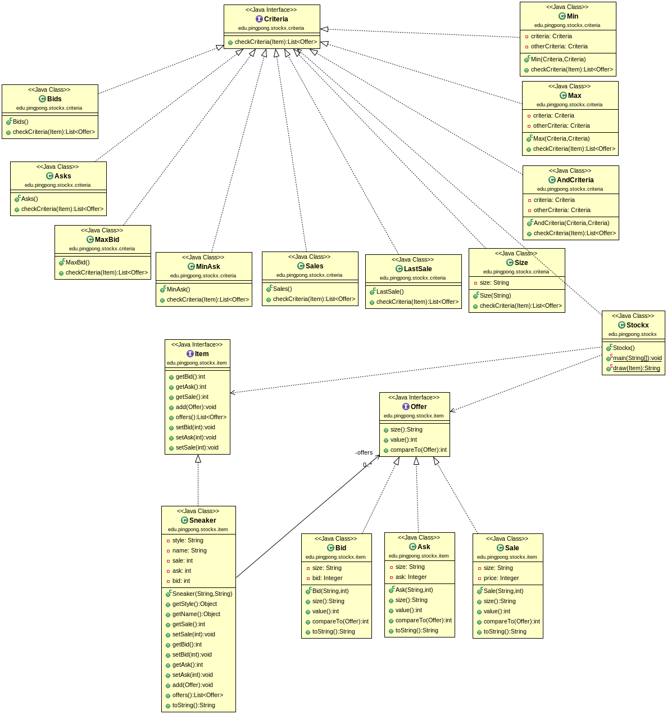

# Ex3-Stockx

StockX nació en Detroit, y allí siguen haciendo las cosas de manera tradicional, robustas y con alma, en ASCII en la CLI.

El objetivo es seguir el siguiente diagrama UML para poder imprimir
las historias de usuario lo más parecido posible.

